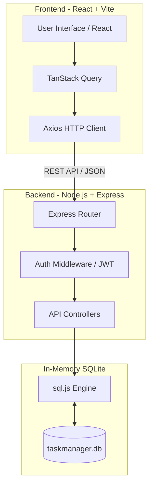

<div align="center">
  <h1>⚡ TaskFlow</h1>
  <p><b>A professional full-stack project & team task management application with role-based access control.</b></p>
</div>

---

## ✨ Features

- **🔐 Authentication:** JWT signup/login, bcrypt hashing, profile & password management.
- **📁 Projects:** Create, update, archive, and delete projects. Custom color themes & progress tracking.
- **👥 Team RBAC (Role-Based Access Control):** 
  - **Global Admin:** Specialized Admin Panel to manage all platform users and view the inbuilt database.
  - **Project Roles:** Admin / Member roles at the project level, invite by email, remove members.
- **✅ Task Management:** Kanban board (To Do → In Progress → Review → Done).
- **🏷 Task Details:** Priority levels, assignees, due dates, tags, and inline comments.
- **📊 Dashboard:** Real-time stats cards, bar charts, my tasks, and upcoming deadlines.
- **🗄️ Inbuilt Database Viewer:** Real-time raw SQLite table viewer directly from the UI for global admins.

---

## 🏗 Architecture Diagram



---

## 🛠 Tech Stack

| Layer | Technology |
|---|---|
| **Runtime** | Node.js 18+ |
| **API** | Express.js 4 |
| **Database** | sql.js (SQLite, zero native dependencies) |
| **Authentication** | jsonwebtoken + bcryptjs |
| **Frontend** | React 18 + Vite |
| **State Management** | TanStack Query v5 |
| **Styling** | Tailwind CSS v3 |
| **Charts & Icons** | Recharts, Lucide React |

---

## 🚀 Quick Start (Development)

### Prerequisites
- Node.js 18+

### 1. Install Dependencies
You can install both backend and frontend dependencies in one command from the project root:
```bash
npm run install:all
```

### 2. Configure Environment
Create a `.env` file in the `backend` directory based on the `.env.example`:
```bash
cd backend
cp .env.example .env
```

### 3. Start Development Servers
Start both servers from the root directory:
```bash
npm run dev:backend    # Runs API on http://localhost:5000
npm run dev:frontend   # Runs App on http://localhost:3000
```

---

## 🧪 Demo Credentials

The platform includes a seeding script. If you run `node backend/seed.js`, you can log in with the following populated accounts:

**👑 Global Admin**
- **Email:** `admin@demo.com`
- **Password:** `password123`
*(Grants access to the Admin Panel & Inbuilt Database Viewer)*

**👤 Standard Members**
- `bob@demo.com`
- `charlie@demo.com`
- `diana@demo.com`
- **Password:** `password123`

---

## 🏭 Production (Single Server)

Build the frontend once, then serve everything securely from the Express backend:

```bash
# Step 1: Build the React frontend
npm run build:frontend

# Step 2: Start the backend (which auto-serves frontend/dist)
npm run start:backend
```

Visit **http://localhost:5000** — the backend serves both the REST API and the built React application.

---

## 🔌 REST API Reference

| Domain | Endpoints | Description | Access |
|---|---|---|---|
| **Auth** | `/api/auth/signup`, `/login`, `/me` | User registration and authentication | Public / Auth |
| **Admin** | `/api/admin/users`, `/api/admin/db` | Platform member management & database viewer | Global Admin |
| **Projects** | `/api/projects/*` | CRUD for projects and project members | Project Admin/Member |
| **Tasks** | `/api/projects/:pid/tasks/*` | CRUD for tasks and comments inside projects | Project Member |
| **Dashboard**| `/api/dashboard/stats` | Aggregated workspace statistics | Auth |

---

## 🗄 Database Schema

The database utilizes SQLite and is automatically created as `backend/taskmanager.db`.

- **`users`**: Platform users and global roles.
- **`projects`**: Project metadata and ownership.
- **`project_members`**: Link table for project-level RBAC.
- **`tasks`**: Kanban tasks associated with projects.
- **`comments`**: User comments on specific tasks.
- **`activity_log`**: Audit trail of workspace actions.

---
<div align="center">
  <p>Made with ⚡ — TaskFlow</p>
</div>
